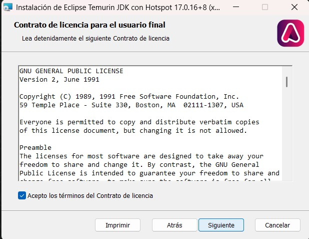
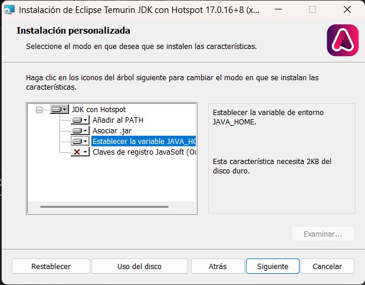
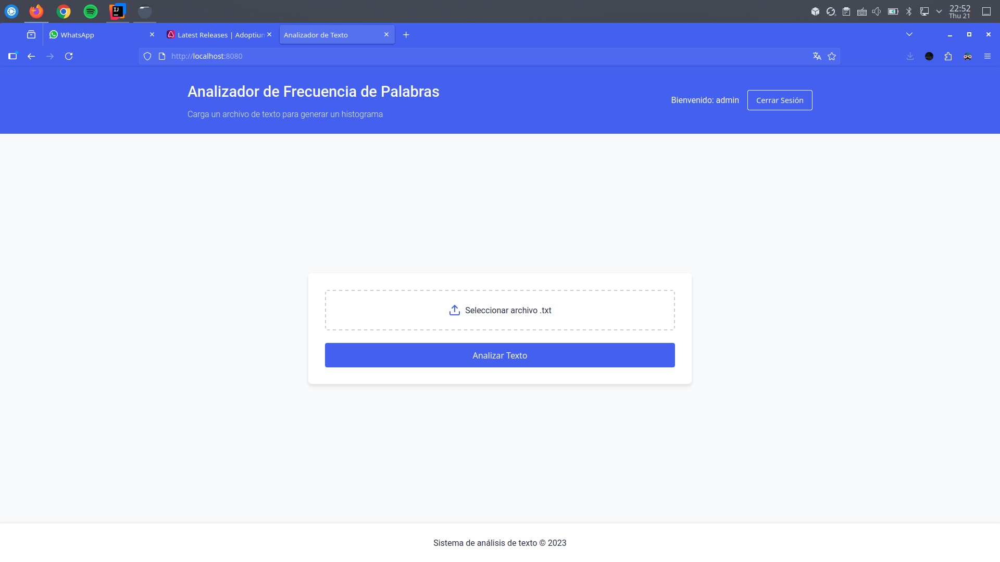

# Histograma para archivos `.txt`

Recibimos de un filepicker un archivo `.txt` para posteriormente procesar el texto y realizar el histograma, esto aplicando algunos filtros para evitar contar palabras redundantes, o caracteres como signos como el `.`, `;`, `,`, etc.

**Indispensable utilizar el JDK 17 o superior**

## Instalación

> Enlace del JDK recomendado y utilizado en este ejemplo en W11: https://adoptium.net/es/temurin/releases

Una vez descargado el JDK recomendado se adjuntan los pasos a seguir:

Una vez finalizado el proceso, verificar que se haya instalado de manera adecuada con el siguiente comando en la terminal: `java --version`. Debería dar la siguiente respuesta en consola: 

Finalmente instalar el repositorio de GitHub.

> Recomendación ejecutar el proyecto desde terminal dirigiéndose a la ruta del proyecto + carpeta target y ejecutar el comando: 

**Ejemplo:**

## Ejemplo de uso

> Se necesita ejecutar primero el proyecto y la ruta para probar es el https://localhost:8080/

Ingresamos a la liga antes mencionada, se necesita iniciar sesión para poder continuar. La información de inicio viene debajo del formulario.

Una vez entrando en el sistema, presionamos el botón para ingresar el archivo `.txt`:

Por último, una vez que aparezca el nombre del archivo seleccionado, procedemos a dar click en **Analizar texto** y se generará el histograma.

Para realizar más pruebas, ingrese a la ruta: http://localhost:8080/
